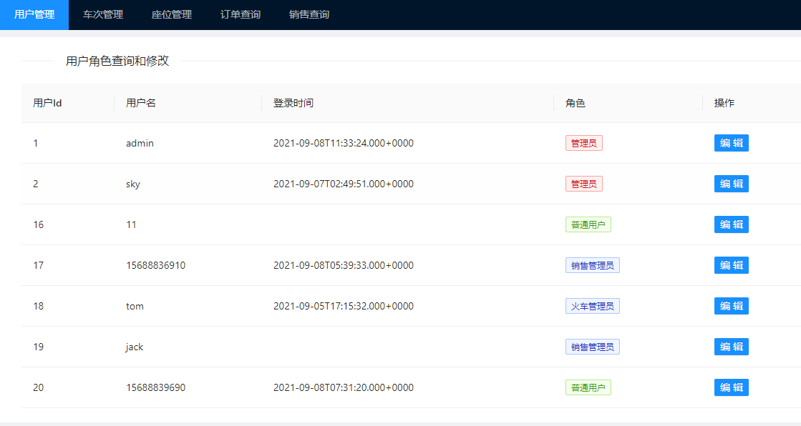
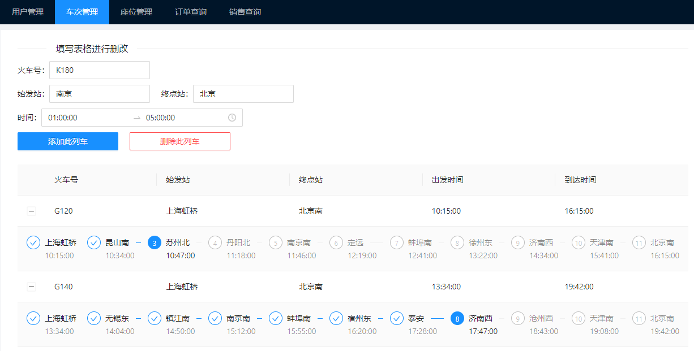

# Introduction

关于此项目的一个简单介绍

项目的接口在 https://blog.skyemperor.top/archives/%E6%95%91%E5%91%BD

如果接口挂了，请[@skyyemperor](https://github.com/skyyemperor)此用户

## Why this project

1. 一个帮忙郭搭建的火车票中台前端
2. 很长时间不写代码了，感觉自己很多东西都生疏了，所以想先练一练手
3. 估计是大学期间很难再写前端项目了，想留个纪念

## Function

1. 查询，修改管理员权限
2. 查询，修改火车班列
3. 查询，修改座位数量
4. 查询票数+一个简单的折线图

## Screen shots

一些简单的截图留作纪念

